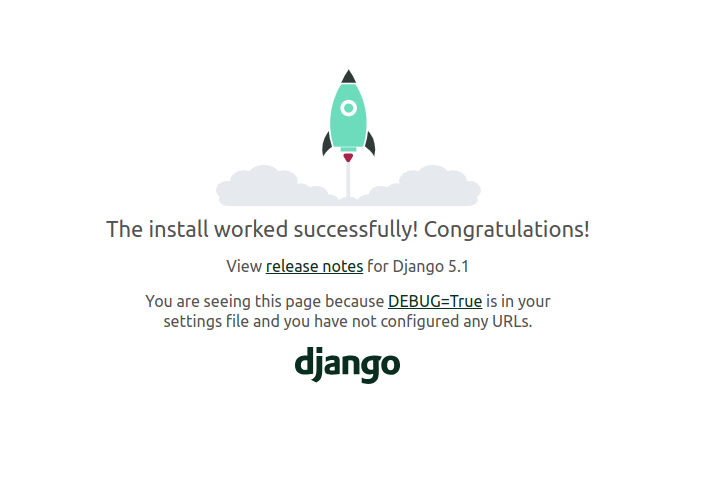

# Django project setup 

The first thing to do is create a virtual environment. 

(NOTE: there are some extra resources included at the end of each section. If there is something that isn't making sense there is a good chance there is a link to something useful there).

We'll use the `venv` module and do things pretty manually. If you want to do things a different way please go ahead. There are many different tools available. Many of these tools are wonderful.
We are doing things the simple way so we don't distract you from the stars of the show. 

Here we go:

```
# make a virtual env named venv
python3 -m venv venv

# activate it
source venv/bin/activate

pip install django

# Now start our application
# Yata == yet another todo app. You can name your app whatever you want to and you can change it later if you feel like it.

django-admin startproject yata
```

This will make a new directory
If you look inside the newly created directory, you'll see something like:

```
├── manage.py
└── yata
    ├── asgi.py
    ├── __init__.py
    ├── settings.py
    ├── urls.py
    └── wsgi.py
```

- The outer yata/ root directory is a container for your project. You can change the name if you want
- manage.py: A command-line utility that lets you interact with this Django project in various ways. We'll be using this a lot.
- The inner yata/ directory is the actual Python package for your project. Its name is the Python package name
- yata/__init__.py: An empty file that tells Python that this directory should be considered a Python package.
- yata/settings.py: Configuration for this Django project. We'll be editing this file later on
- yata/urls.py: The URL declarations for this Django project; a “table of contents” of your Django-powered site. We'll be working with this later on
- yata/asgi.py: An entry-point for ASGI-compatible web servers to serve your project. This is not in scope in this tutorial
- yata/wsgi.py: An entry-point for WSGI-compatible web servers to serve your project. This is not in scope in this tutorial 

## Run the application 

Use this command to run the development server: 

```
python manage.py runserver
```

There will be some warnings in the console. It'll say something like:

```
You have 18 unapplied migration(s). Your project may not work properly until you apply the migrations for app(s): admin, auth, contenttypes, sessions.
Run 'python manage.py migrate' to apply them.
```

Don't worry :) We'll deal with those soon.

Head on over to [http://127.0.0.1:8000/](http://127.0.0.1:8000/) to visit the site.

You'll see a nice looking website with a rocket on it. Rockets are great.



## Git

You should be making use of git to keep track of your work.  While Git itself is out of scope in this tutorial, it would be useful to make use of it while you go through the work. Especially when you get to the part about building your own project!

use `git init` to initialise your repo.

Make sure you have a sensible `.gitignore` file. This should do the trick:

```
venv/
db.sqlite3
__pycache__/
*.pyc
test-results/
node_modules/
.pytest_cache/
```

You can also create a repo on Github or similar if you would like to.

## Extra learning resources

If you want to do a more in-depth Django set-up tutorial, then the official docs do a great job. 

https://docs.djangoproject.com/en/5.1/intro/tutorial01/

To learn more about virtual environments: 
- https://csguide.cs.princeton.edu/software/virtualen
- https://realpython.com/python-virtual-environments-a-primer/

To learn more about git:
- https://git-scm.com/book/en/v2 This is a whole book. You probably don't need the whole thing. For this tutorial, the "basics" are useful. If you want do anything serious you should know about branching.