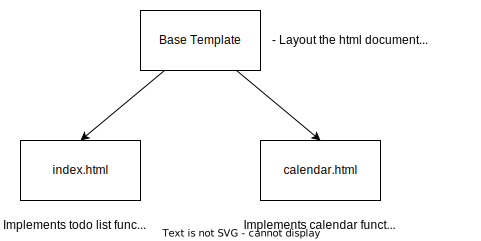

# Organising your templates 

Currently, your yata app should have 2 templates:

- index.html 
- partial_todo_item.html 

These work fine in a small application but, as applications become more complicated, it becomes necessary to organise templates in better ways. 

There are 2 different techniques we'll go through: 

- template inheritance 
- template partials 

## Template inheritance 

The index.html file has a few responsibilities:

- it lays out the whole HTML document
- it defines the head of the document and makes sure htmx, alpinejs and tailwind are included 
- it draws the header bar of the page, with the logo and menu items 
- it draws out the todo list and the different CRUD functionality associated with that list 

Our application is quite sime at this point. Let's take a moment to consider a different page. Let's say we wanted to make a page that displayed the todo list items on a calendar so you could see when everything is meant to be done. This is purely hypothetical, we are not going to build this at this point. 

In this case we might need a calendar.html file. That file would have a few different responsibilities. It would

- lay out the whole HTML document
- define the head of the document and make sure htmx, alpinejs and tailwind are included 
- draw the header bar of the page, with the logo and menu items 
- draw out the calendar and related functionality

One might be tempted to make a copy of the index.html page, rename it to `calendar.html` and then change what needs to be changed.

This would work. But the code would not be DRY and that would cause problems down the line. For example, if you needed to add a new header menu item, you would need to go edit every page where the header menu is implemented. Or if you wanted to give every page a footer with your copyright and social media links, it would become repetitive.

### The solution 

Template inheritance allows you to create a template that contains common functionality and elements, and then use that template as a base for other work. 

In the case of the example above, what we would do is create a base template with the common functionality. The base template would:

- lay out the whole HTML document
- define the head of the document and make sure htmx, alpinejs and tailwind are included 
- draw the header bar of the page, with the logo and menu items 

Then the index.html template would inherit from the base template and then only implement the todo list CRUD functionality. The calendar.html template would do similar - it would inherit from the base template and then implement only what it needs to.



### Let's build a base template 

In this section we'll be making use of a few different parts of the Django template language. Here is a reference:

https://docs.djangoproject.com/en/5.1/ref/templates/language/


Start off by renaming your `index.html` file to `_base.html`. Yes, you heard me.

Now create a new `index.html` file.

If you refresh your page it will be empty.

Now we can start moving things around.

Add the following line to the start of `index.html`:

```

```

Now if you refresh your page it will look like it did before, your todo CRUD functionality will be there as it was originally.

Now, go over to your `_base.html` page and cut (ctrl+x) the stuff that shouldn't be in there, and then paste (ctrl+v) it into the index.html file.

Now when you refresh the page, you'll see the header area but the TODO list functionality wont be there.

The last thing do to is define a thing called a "block"

In `_base.html` add the following right before the  closing `</body>` tag:

```
    
    Replace in child templates
    
```

So it should look like:

```
.....
</div>    <!-- this is the end of the header area div  -->

    
    Replace in child templates
    

</body>
</html>
```

Now refresh your page, what do you see? 

Now, the last thing to do is to go to your index.html page and:

- put a `` right above your todo list HTML
- put a `` right underneath it 

Now your application should be back to it's working state. 

Run your tests to be sure.

## More inheritance 

We have one base template and one page that inherits from it. This is a pretty simple template hierarchy.

Often, things can become more complicated. You can have multiple templates that get inherited from in different situations. 

You might have something like this:

- _base.html: Sets up the html document and `head` tag
- _single_column_layout: Inherits from _base and arranges content in a single column 
- _two_column_layout: Inherits from base and defines 2 blocks: `` and ``

In other words, it it often useful to have multiple levels to your template hierarchy, and different templates can inherit from different places.

## Side quest: Can you add another page?

Add another page to your website. Perhaps you want an `about us` page or something. Feel free to make it something dead simple. You'll need to set up a url, a view and a template for that page. 

Can you get the page to work? 

How can the user navigate to that page? Can you create a link that gets them there from your index page?

## Template partials 

We'll cover this in the next part of the tutorial